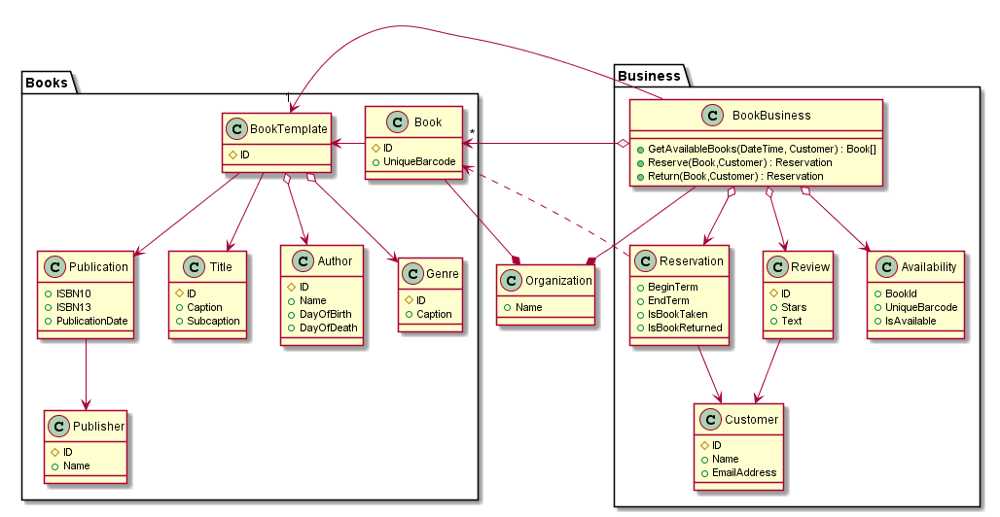

# Nerds.Library

This web service implements a Library API as specified by [library-api.pdf](library-api.pdf). This is a programming test.

## Requirements analysis

Having read the specification, I am making the following modifications:

### Authentication

I'd simplify or postpone the requirements that require 'authentication'. I do that because doing authentication and authorization is a complex topic I need to investigate further.

### E-mailing

I'd simplify the requirements that require 'e-mailing' so that the *data* that should be e-mailed about can be queried via the API, but no actual e-mail is sent. I do that because:

- I reckon this data is useful in other scenarios as well (e.g., push notifications, web dashboards etc.).
- having a background service running continuously (and guaranteed to do so properly) is complexity I need to investigate.
- sending periodic e-mails could be done (perhaps even better) by outside systems that just query the API.

### Reserving and returning

I'd implement some of the 'reserve/return' (loan, unloan) requirements together, because
  - they are complementary or supporting in a test cycle for the other.
  - no viable product could exists that only implements just loaning without returning.

### Limiting scope

I'm not doing anything about library business policies (late fees) or content administration (managing the books in the library itself). There's no explicit requires to implement these features and there's a world of possibilities there.

There's more things to investigate in the world of libraries, like the [Dewey Decimal Classification](https://en.wikipedia.org/wiki/Dewey_Decimal_Classification) and e-books. Not doing anything with that

## Development planning

I intend to develop this assignment as follows:

- Model the domain
- Configure project
  - Set-up metadata
  - Enable static analyzers ([FxCop](https://www.nuget.org/packages/Microsoft.CodeAnalysis.FxCopAnalyzers))
  - Install Swagger tools ([SwashBuckle](https://docs.microsoft.com/en-us/aspnet/core/tutorials/getting-started-with-swashbuckle?view=aspnetcore-2.2&tabs=visual-studio)
- Implement domain.
- Model and implement the API for the domain queries (details, lists, sorting, filtering)
- Model and implement the API for the domain commands/mutations (reservations, returns, rating)
- Implement SpecFlow to perform automated testing.
- Implement the API with a mock-up domain.
- Implement a storage back-end.
- Implement authentication and authorization.
- ...

## Domain analysis

See the following class diagram:

### Book instances versus types

Distinguishing between book instances and book types is harder than it looks.

One could argue every physical book instance can be perfectly tracked in the world, but that would require a unique barcode or something. I'm assuming we'll do that.

A single 'book type' is also hard, given that (effectively) the same book could have different ISBNs or slightly different books could still have the same ISBN (e.g., reprints). Therefore, we're using book 'templates' instead of full-on 'types', just a way to prevent unnecessary data duplication, but we're not forcing books into a strong 'type classification system'.

### ISBN

ISBN exists in two formats: ISBN-10 or ISBN-13. The same books can have codes in both. I have not investigated whether there's a conversion between them, so I'm modelling both for now.

The same book in different languages or different forms (hardcover, softcover) will have different ISBNs, even though they are interchangeable for many purposes.

### Dimension classes

I'm splitting off attributes into separate classes (or "dimension") like a [star schema](https://en.wikipedia.org/wiki/Star_schema) because:

- Book metadata can get messy quickly. We may want to correct a whole slew of metadata at once.
- Having separate dimension tables can also have technical benefits for data marts and performance.
- Having separate classes may also allow those classes (e.g., 'Publisher', 'Author', 'Genre') to become first-class citizens in our system. (Indeed, sorting on 'Authors' that are deceased is such a case.)
- I also assume we might want to localize some captions to other languages (e.g, 'Genre' and 'Title'). I do not implement that but I have some ideas on how to do that.
- There may be multiple of everything (Authors, Genres): parsing and splitting string properties would be wasteful.

If we had stuck with simple string attributes in the 'BookTemplate' class (without dimension classes), we might choose to stick to the [Bibtex specification](https://en.wikibooks.org/wiki/LaTeX/Bibliography_Management).

### Ratings

The origin of ratings remains unspecified. I assume Customers might submit a rating at some point (e.g., during the book 'returning' process). The system does not force this process and would currently allow anyone to add a rating at any time.
